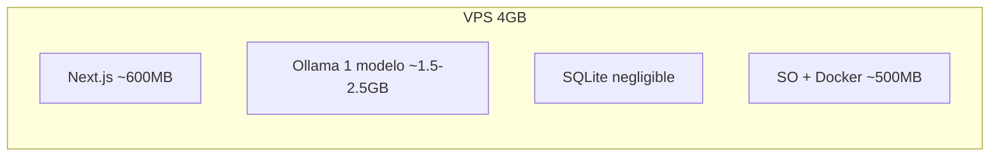
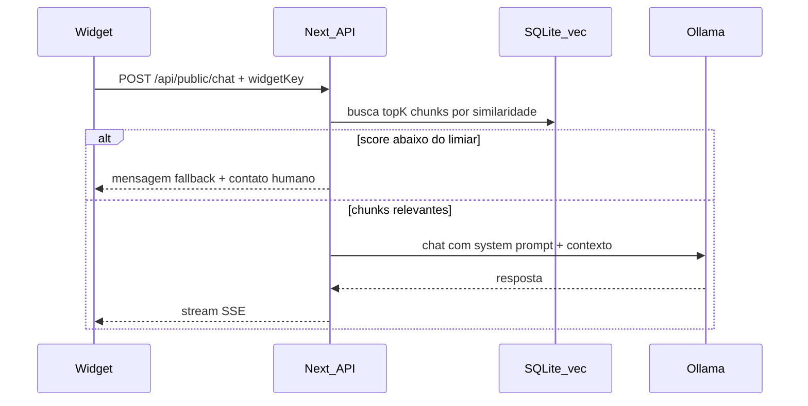
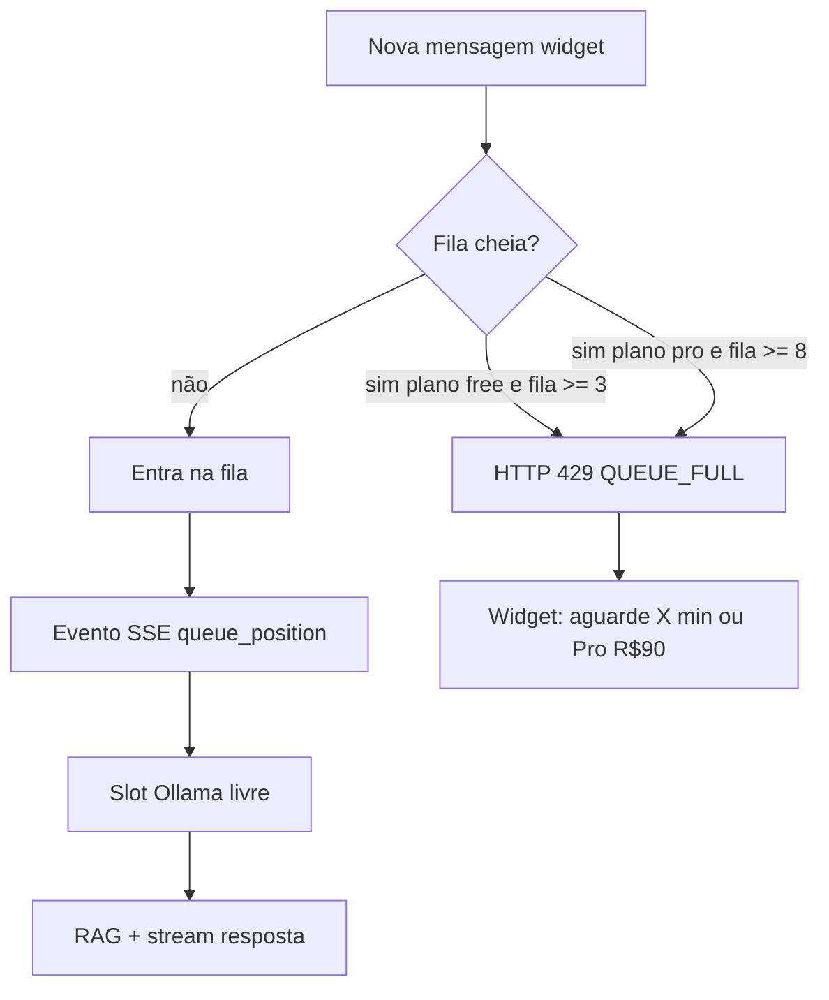

# Plano: SaaS de Base de Conhecimento + Chat Ollama (Next.js)

> Skill **superpowers:writing-plans** — plano detalhado será persistido em `[docs/superpowers/plans/2026-05-28-knowledge-base-chat.md](docs/superpowers/plans/2026-05-28-knowledge-base-chat.md)` na fase de implementação.

**Goal:** Painel multi-organização para gerenciar KB, configurar atendente IA e publicar snippet JS; chat público responde **somente** com RAG sobre a KB, com fallback para contato humano.

**Architecture:** Next.js 16 (App Router, `standalone` Docker) + SQLite (`better-sqlite3` + **sqlite-vec**) + Ollama (chat + embeddings). Widget em bundle separado servido em `/widget/v1.js`. Auth.js v5 com sessão no servidor; APIs do widget autenticadas por **Widget API Key** + **allowed origins**.

**Tech Stack (decisões suas + recomendações fechadas):**


| Área            | Escolha                                                      |
| --------------- | ------------------------------------------------------------ |
| Framework       | Next.js 16 App Router, TypeScript                            |
| Auth            | Auth.js v5 (Credentials + adapter Drizzle)                   |
| DB              | SQLite + sqlite-vec                                          |
| ORM             | Drizzle (leve, migrations SQL explícitas)                    |
| Validação       | Zod                                                          |
| UI              | Tailwind CSS 4 + shadcn/ui                                   |
| IA              | Ollama HTTP API (`/api/chat`, `/api/embed`)                  |
| Testes          | Vitest + React Testing Library; Playwright (fluxos críticos) |
| Qualidade       | ESLint, Prettier, Husky + lint-staged                        |
| Package manager | pnpm                                                         |
| Licença         | MIT                                                          |


**Nota sobre “superpowers”:** skills em `~/.codex/.tmp/plugins/plugins/superpowers/` — aplicar **test-driven-development** (RED-GREEN-REFACTOR), **writing-plans** (salvar planos em `docs/superpowers/plans/`) e **create-rule** (`.cursor/rules/*.mdc` + `AGENTS.md`).

---

## Restrições da VPS (4GB RAM)




**Estratégia de memória (obrigatória no `docker-compose`):**

- `OLLAMA_MAX_LOADED_MODELS=1` — nunca chat + embed carregados ao mesmo tempo em produção pequena, **ou** usar modelo de embedding muito leve e `keep_alive` curto.
- **Modelo de chat (escolha principal):** `qwen2.5:3b-instruct-q4_K_M` — bom equilíbrio instrução/português/personalidade no tamanho 3B.
- **Alternativa mais leve:** `gemma2:2b-it-q4_K_M` — menos RAM, personalidade um pouco mais “seca”.
- **Alternativa com mais “voz”:** `llama3.2:3b-instruct-q4_K_M` — bom tom conversacional; testar latência no 1 vCPU.
- **Embeddings:** `nomic-embed-text` (~274MB) — padrão maduro para RAG; evitar carregar `embeddinggemma` junto com Qwen 3B no mesmo host.
- **Não recomendado nesta VPS:** modelos 7B+, dois modelos grandes simultâneos, ou rerankers extras sem swap.

**Fluxo RAG (guardrail “só KB”):**




---

## Estrutura do repositório (greenfield — pasta vazia hoje)

```
small-local-ai-project/
├── LICENSE                          # MIT
├── README.md
├── docker-compose.yml
├── Dockerfile
├── .env.example
├── AGENTS.md                        # contexto para agentes
├── .cursor/rules/                   # TDD, clean code, RAG, API
├── docs/
│   ├── superpowers/plans/           # este plano + futuros
│   └── ai/                          # templates de prompt do atendente
├── drizzle/                         # migrations + schema
├── src/
│   ├── app/                         # App Router (dashboard)
│   ├── app/api/                     # Route Handlers
│   ├── lib/
│   │   ├── auth/                    # Auth.js config
│   │   ├── db/
│   │   ├── rag/                     # chunk, embed, retrieve, prompt
│   │   └── ollama/
│   └── components/
├── widget/                          # bundle embed (esbuild)
│   └── src/widget.ts
├── public/widget/v1.js              # artefato build
└── tests/
    ├── unit/
    └── e2e/
```

---

## Modelo de dados (multi-org desde o início)

Entidades principais:

- `users`, `accounts`, `sessions` (Auth.js)
- `organizations`, `organization_members` (role: `owner` | `admin` | `member`)
- `knowledge_bases` (por org)
- `knowledge_documents` + `knowledge_chunks` (texto + `embedding` BLOB + metadata)
- `attendant_configs` (nome, personalidade, tom, instruções, `fallback_email`, `fallback_phone`, mensagem de escalonamento)
- `widget_keys` (`public_key`, `allowed_origins[]`, `organization_id`, ativo)
- `organizations.plan`: `free` | `pro` (Pro ativado **manualmente** após contato comercial — sem checkout)
- `pro_leads` (lista de interessados no Pro — somente consulta futura)

Índice vetorial: tabela `knowledge_chunks` com coluna vetorial via **sqlite-vec**; dimensão fixa conforme `nomic-embed-text` (768).

---

## Capacidade da VPS: atendimentos simultâneos

### O gargalo real

Em **1 vCPU + 4GB RAM**, o limite não é “quantos widgets abertos”, e sim **quantas inferências Ollama rodam ao mesmo tempo**. Cada turno de chat RAG inclui:

1. Embedding da pergunta (~0,2–2 s, ou +5–20 s se precisar trocar modelo com `OLLAMA_MAX_LOADED_MODELS=1`)
2. Busca vetorial no SQLite (~<50 ms)
3. Geração LLM no CPU (~10–40 s para ~150–300 tokens com Qwen2.5 3B Q4)

Com **1 vCPU**, o Ollama processa inferências de forma **essencialmente serial**. Paralelizar 2+ chats ao mesmo tempo divide o CPU e aumenta latência e risco de OOM.

### Números recomendados para o produto (honestos)


| Métrica                                                | Plano Free        | Plano Pro (R$ 90 — validação)                   | Limite físico da VPS                |
| ------------------------------------------------------ | ----------------- | ----------------------------------------------- | ----------------------------------- |
| Inferências IA **ao mesmo tempo** (global no servidor) | 1                 | 1 (mesma VPS; Pro ganha **prioridade na fila**) | **1** sustentável                   |
| Posição máxima na **fila de espera**                   | 3                 | 8                                               | ~5–8 antes de UX ruim               |
| Usuários “conversando” com resposta em <30 s           | ~1                | ~1 (+ fila priorizada)                          | ~1 ativo                            |
| Usuários aguardando na fila (experiência aceitável)    | até 3             | até 8                                           | fila total ~5–10 com espera 2–5 min |
| Pico absoluto antes de recusar novos                   | fila cheia → erro | fila cheia → erro                               | >10 na fila → 5–15 min de espera    |


**Resposta direta:** na sua VPS, o máximo **sustentável** é **1 atendimento IA ativo por vez** no servidor inteiro, com **3–5 pessoas na fila** ainda aceitável. Acima disso, latência explode e a experiência degrada — daí o tratamento de erro + upsell Pro.

> Pro **não aumenta vCPU/RAM** neste MVP: aumenta **prioridade na fila**, **fila maior** e **limites de uso mais altos**. Upgrade real de capacidade = VPS maior (fora do escopo).

### Variáveis de ambiente (defaults)

```env
INFERENCE_MAX_CONCURRENT=1          # semáforo global Ollama
QUEUE_MAX_WAIT_FREE=3
QUEUE_MAX_WAIT_PRO=8
QUEUE_MAX_WAIT_SECONDS=300          # 5 min; após isso, 408/timeout amigável
ESTIMATED_SECONDS_PER_JOB=25        # base para ETA na fila
```

---

## Planos Free vs Pro + fila de inferência




**Implementação:** `src/lib/concurrency/inference-queue.ts`

- Semáforo global: máx. **1** job Ollama ativo (`INFERENCE_MAX_CONCURRENT`)
- Fila in-memory por processo Node (adequado ao MVP single-instance na VPS)
- **Fair scheduling:** round-robin entre `organization_id` para um site viral não monopolizar
- **Prioridade Pro:** jobs `plan=pro` passam à frente de `free` na mesma fila
- Job expõe: `position`, `estimatedWaitSeconds`, `plan`

**Contrato de API pública** (`POST /api/public/chat`):


| Código HTTP | `error.code`        | Quando                             | Resposta ao usuário                                                    |
| ----------- | ------------------- | ---------------------------------- | ---------------------------------------------------------------------- |
| 202         | `QUEUED`            | Entrou na fila                     | SSE: `queue_position`, `estimated_wait_seconds`                        |
| 429         | `QUEUE_FULL`        | Fila no limite do plano            | “Recursos em uso. Aguarde alguns minutos e tente novamente.” + CTA Pro |
| 503         | `CAPACITY_EXCEEDED` | Ollama indisponível/OOM            | “Sistema sobrecarregado. Tente em 2–3 minutos.” + CTA Pro              |
| 408         | `QUEUE_TIMEOUT`     | Esperou > `QUEUE_MAX_WAIT_SECONDS` | “Tempo de espera esgotado. Tente novamente.”                           |


**Widget (Shadow DOM):** estados visuais

1. `idle` — input habilitado
2. `queued` — “Você é o **Nº X** na fila. Tempo estimado: **~Y min**.”
3. `streaming` — resposta da IA
4. `capacity_error` — mensagem + botão **“Conhecer Plano Pro — R$ 90/mês”** → abre LP em nova aba
5. Sem checkout; apenas redirecionamento

---

## Landing Page Pro + lista de leads (sem pagamento)

### Fluxo

1. Usuário no widget recebe `QUEUE_FULL` ou clica no CTA Pro
2. Redireciona para `**/upgrade?org={slug}&source=widget`** (LP pública no mesmo Next.js)
3. LP exibe benefícios Pro (fila prioritária, fila maior, limites maiores) e preço **R$ 90/mês** — texto de validação, sem gateway
4. Formulário: **nome**, **email**, **telefone** (Zod; telefone formato BR opcional)
5. `POST /api/public/pro-leads` → persiste e retorna 201
6. Página `**/upgrade/obrigado`** — “Entraremos em contato em breve”

### Tabela `pro_leads`


| Campo             | Tipo        | Notas                                      |
| ----------------- | ----------- | ------------------------------------------ |
| `id`              | uuid        | PK                                         |
| `name`            | text        | obrigatório                                |
| `email`           | text        | único por 24h opcional (anti-spam)         |
| `phone`           | text        | obrigatório                                |
| `organization_id` | fk nullable | se veio do widget                          |
| `widget_key_id`   | fk nullable | rastreio                                   |
| `source`          | enum        | `widget` | `lp` | `dashboard`              |
| `status`          | enum        | `new` | `contacted` | `converted` (manual) |
| `created_at`      | datetime    |                                            |


**Sem pagamento:** campo `status=converted` só quando admin marcar Pro manualmente em `organizations.plan`.

### Dashboard (consulta futura)

- Rota `**/dashboard/leads`** (apenas `owner`/`admin` da plataforma ou super-admin MVP)
- Tabela read-only: nome, email, telefone, org, data, status
- Ações manuais: marcar `contacted` / `converted`; botão “Ativar Pro” na org vinculada
- Export CSV opcional (fase 2)

### APIs novas


| Rota                          | Auth                 | Função                   |
| ----------------------------- | -------------------- | ------------------------ |
| `POST /api/public/pro-leads`  | público (rate limit) | salvar lead              |
| `GET /api/admin/leads`        | sessão owner         | listar leads             |
| `PATCH /api/admin/leads/[id]` | sessão owner         | atualizar status         |
| `PATCH /api/orgs/[id]/plan`   | owner                | ativar `pro` manualmente |


---

## Funcionalidades por fase

### Fase 1 — Fundação + DX

- Scaffold Next.js 16 + pnpm + TypeScript strict
- Drizzle + SQLite (volume Docker `./data`)
- Auth.js: registro/login (credentials, bcrypt)
- Husky: `pre-commit` → lint-staged (eslint + prettier + `vitest related`)
- Arquivos de contexto IA:
  - `[AGENTS.md](AGENTS.md)` — visão, comandos, convenções
  - `[.cursor/rules/tdd.mdc](.cursor/rules/tdd.mdc)` — iron law TDD (superpowers)
  - `[.cursor/rules/clean-code.mdc](.cursor/rules/clean-code.mdc)`
  - `[.cursor/rules/rag-guardrails.mdc](.cursor/rules/rag-guardrails.mdc)`
  - `[docs/ai/system-prompt-template.md](docs/ai/system-prompt-template.md)`
- `[LICENSE](LICENSE)` MIT + `[docs/superpowers/plans/2026-05-28-knowledge-base-chat.md](docs/superpowers/plans/2026-05-28-knowledge-base-chat.md)`

### Fase 2 — CRUD KB (dashboard)

- Rotas: `/dashboard`, `/org/[slug]/knowledge`, create/edit/delete documentos
- Ao salvar documento: chunking (~~500 tokens, overlap 50) → embed Ollama → upsert chunks (TDD em `lib/rag/chunk.test.ts`, `lib/rag/retrieve.test.ts`)
- Listagem + busca textual simples no painel

### Fase 3 — Configuração do atendente

- Tela `/org/[slug]/settings/attendant`
- Campos: nome, personalidade, características, tom, instruções extras
- Fallback: email e/ou telefone + mensagem padrão quando `confidence < threshold` ou usuário pede humano
- Preview de chat no painel (mesmo pipeline RAG, sessão autenticada)

### Fase 4 — Widget embeddable (script + Shadow DOM)

- Build `widget/` → `public/widget/v1.js` (IIFE, sem conflito CSS)
- Snippet gerado no painel:

```html
<script
  src="https://SEU_DOMINIO/widget/v1.js"
  data-widget-key="wk_..."
  data-position="bottom-right"
  async
></script>
```

- UI: botão flutuante → painel chat; estilos isolados em Shadow DOM
- API pública: `POST /api/public/chat` (stream), `GET /api/public/widget/config`
- Segurança: validar `Origin`/`Referer` contra `allowed_origins`; rate limit in-memory por IP + widget key
- Integrar fila de inferência + estados `queued` / `capacity_error` + link para `/upgrade`

### Fase 5 — Concorrência, planos e LP Pro

- `inference-queue.ts` + testes TDD (enqueue, prioridade Pro, fair round-robin, `QUEUE_FULL`)
- Campo `organizations.plan` + limites derivados do plano
- LP `/upgrade` + `/upgrade/obrigado` + API `pro-leads`
- Dashboard `/dashboard/leads` (read-only + ativar Pro manual)
- Mensagens i18n PT-BR nos erros do widget

### Fase 6 — Docker produção

`[docker-compose.yml](docker-compose.yml)`:

```yaml
services:
  ollama:
    image: ollama/ollama
    volumes: [ollama_data:/root/.ollama]
    environment:
      OLLAMA_MAX_LOADED_MODELS: "1"
    # healthcheck GET /api/tags

  app:
    build: .
    depends_on: [ollama]
    environment:
      OLLAMA_BASE_URL: http://ollama:11434
      DATABASE_URL: file:/app/data/app.db
    volumes: [app_data:/app/data]
    ports: ["3000:3000"]
```

- Dockerfile multi-stage (padrão Next **standalone** — Context7 `/vercel/next.js`)
- Script `scripts/pull-models.sh` para baixar `qwen2.5:3b-instruct-q4_K_M` + `nomic-embed-text`
- README com deploy VPS (swap 2GB recomendado, firewall, reverse proxy Caddy/Nginx + TLS)

---

## Prompt do atendente (RAG-only)

Template em `[docs/ai/system-prompt-template.md](docs/ai/system-prompt-template.md)`:

- Identidade: `{attendant_name}`, personalidade `{personality}`, tom `{tone}`
- Regra absoluta: responder **apenas** com base em `<context>`; se insuficiente, usar `{fallback_message}` e exibir `{fallback_email}` / `{fallback_phone}`
- Proibir inventar políticas/preços não presentes nos chunks
- Opcional: pedir clarificação antes de fallback

Parâmetros Ollama sugeridos: `temperature: 0.3`, `top_p: 0.9` (RAG factual); aumentar levemente se quiser mais “personalidade”.

---

## TDD e Clean Code (superpowers)

Cada feature segue ciclo **RED → GREEN → REFACTOR**:

1. Teste de unidade falha (`vitest`)
2. Implementação mínima
3. Refactor mantendo verde
4. Commit (quando solicitado): `[PROJ-001] feat: ...` — substituir `PROJ-001` pelo Jira real

**Prioridade de testes:**

- `lib/rag/chunk.ts` — divisão de texto
- `lib/rag/retrieve.ts` — similaridade + threshold
- `lib/rag/prompt.ts` — montagem system prompt + fallback
- `lib/auth/permissions.ts` — RBAC org (owner/admin/member)
- E2E Playwright: login → criar doc → preview chat; widget carrega e envia mensagem (mock Ollama em CI)

**Clean code:** camadas finas — Route Handler só orquestra; lógica em `lib/`; DTOs Zod; sem “god files”.

---

## APIs essenciais


| Rota                              | Auth                | Função                       |
| --------------------------------- | ------------------- | ---------------------------- |
| `POST /api/auth/`*                | público             | Auth.js                      |
| `CRUD /api/orgs/[id]/knowledge`   | sessão + RBAC       | documentos                   |
| `PUT /api/orgs/[id]/attendant`    | sessão + RBAC       | config atendente             |
| `POST /api/orgs/[id]/widget-keys` | owner/admin         | gerar key + origins          |
| `POST /api/public/chat`           | widget key + origin | chat RAG stream (fila + SSE) |
| `GET /api/public/widget/config`   | widget key          | nome/cores do bot            |
| `POST /api/public/pro-leads`      | rate limit          | captura lead Pro             |
| `GET /api/admin/leads`            | sessão owner        | lista leads                  |
| `PATCH /api/orgs/[id]/plan`       | owner               | ativar Pro manual            |


---

## Riscos e mitigações


| Risco                | Mitigação                                                              |
| -------------------- | ---------------------------------------------------------------------- |
| OOM com 4GB          | 1 modelo carregado; Gemma2 2B se Qwen falhar; swap file                |
| Latência 1 vCPU      | streaming SSE; chunks pequenos; cache de embed; fila com ETA honesta   |
| Pico de tráfego      | semáforo global=1; fila limitada; 429 + CTA Pro; fair queue entre orgs |
| Widget XSS           | Shadow DOM; sanitizar markdown; CSP no domínio do app                  |
| Respostas alucinadas | threshold de similaridade + prompt estrito + “não sei” → fallback      |


---

## Documentação Context7 consultada

- Next.js 16: Route Handlers, auth em handlers, Docker standalone (`/vercel/next.js/v16.1.6`)
- Ollama: `/api/embed`, `/api/chat`, compat OpenAI embeddings (`/websites/ollama_api`)

---

## Entregáveis na primeira implementação (após aprovação do plano)

1. Repositório scaffold completo com Docker Compose funcional
2. Auth + orgs + CRUD KB com indexação vetorial
3. Chat preview no painel + config atendente
4. Widget `v1.js` + snippet copiável
5. Planos em `docs/superpowers/plans/`, MIT, Husky, regras `.cursor/`, `AGENTS.md`
6. README deploy VPS + modelos recomendados + seção “capacidade e planos”
7. Fila de inferência + erros de capacidade + LP Pro + lista `pro_leads`

